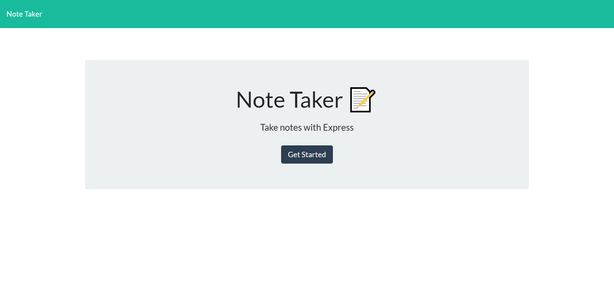
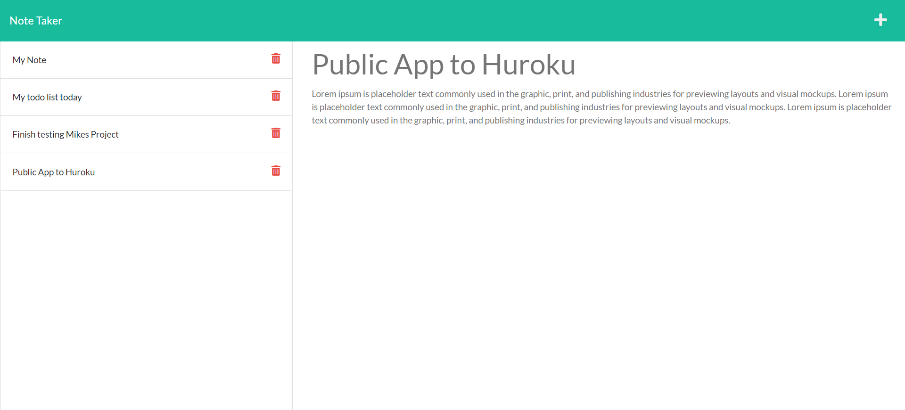

# Note Taker with Express/Node.js Server

This application allows for users to enter notes via the client side which is available in the public folder and they will be saved to a JSON file for persistence using a [node.js](https://nodejs.org/en/) and [express.js](https://expressjs.com/) server and the libraries [file system](https://nodejs.org/api/fs.html) and [path](https://nodejs.org/api/path.html). The server allows for the serving of a static index (/) and notes (/notes) web pages and an API with GET/POST/DELETE functionality. 

See the application function live on Huroku: https://note-taker-express-nodejs-json.herokuapp.com/

# API

The API calls available currently are:

* GET - Read All Notes @ /api/notes
* POST - Create Note @ /api/notes
* DELETE - Delete Note of ID @ /api/notes/id

## Installation

Clone the repo down from github and then  run `npm install --save-dev nodemon` and `npm i` while at the directory with packages.json to install dependences. Then run `node ./server.js` to run the server. By default the site should be available at http://localhost:3001/ but the port can be customized on `server.js`. You can also run `nodemon server.js` as [nodemon](https://www.npmjs.com/package/nodemon) is installed for a dev dependency. The API will be available as described above. 

## Screenshots

